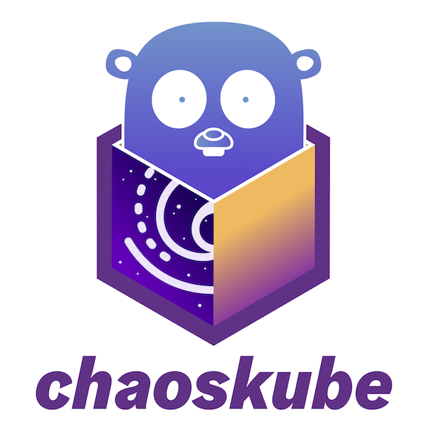

# Wordt een "Agent of Chaos" met ChaosKube

*[Jelle Schrans, oktober 2024.](https://github.com/hanaim-devops/devops-blog-JelleSchrans)*
<hr/>

Momenteel ben ik bezig met de minor DevOps, en Chaos Engineering is een van de onderwerpen die daarin voorbij komt. In deze blog ga ik dieper in op wat Chaos Engineering precies inhoudt en hoe ChaosKube kan worden ingezet om Chaos Engineering toe te passen in een Kubernetes-omgeving.

<p align="center"></p>

## Inhoudsopgave

- [Wordt een "Agent of Chaos" met ChaosKube](#wordt-een-agent-of-chaos-met-chaoskube)
  - [Principes van Chaos Engineering](#principes-van-chaos-engineering)
  - [ChaosKube](#chaoskube)
    - [Filteren op labels](#filteren-op-labels)
    - [Filteren op namespaces](#filteren-op-namespaces)
    - [Filteren op namespace labels](#filteren-op-namespace-labels)
    - [Filteren op OwnerReference's](#filteren-op-ownerreferences)
    - [Filteren op pod-namen](#filteren-op-pod-namen)
    - [Combineren van filters](#combineren-van-filters)
    - [Opt-in annotaties](#opt-in-annotaties)
  - [Voordelen en uitdagingen](#voordelen-en-uitdagingen)
    - [Voordelen](#voordelen)
    - [Uitdagingen](#uitdagingen)
  - [Resultaten analyseren](#resultaten-analyseren)
  - [Best practices](#best-practices)
  - [Bronnen](#bronnen)
  - [Conclusie](#conclusie)

## Principes van Chaos Engineering

Het doel van Chaos Engineering is om de robuustheid en veerkracht van gedistribueerde systemen te testen en te verbeteren. Dit wordt gedaan door het introduceren van storingen in het systeem en te observeren hoe het systeem reageert op deze storingen. Door het systematisch introduceren van storingen kan worden vastgesteld waar de zwakke punten in het systeem (in dit geval een Kubernetes cluser) zitten en kunnen maatregelen worden genomen om deze zwakke punten te verhelpen voordat deze problemen op kunnen gaan leveren. [Phoenixnap, 2024](https://phoenixnap.com/blog/chaos-engineering)

Bij Chaos Engineering voer je dan ook experimenten uit waarover van te voren goed is nagedacht. Hierbij voer je onderstaande stappen uit:

1. **Definieer een hypothese**: Bedenk wat er zou moeten gebeuren als er een storing optreedt. [Gremlin, 2023](https://www.gremlin.com/community/tutorials/chaos-engineering-the-history-principles-and-practice#:~:text=Chaos%20Engineering%20is%20a%20disciplined,end%20up%20in%20the%20news.)
2. **Bepaal de kleinst mogelijke test**: Bepaal wat de kleinste test is (ofwel de blast radius) die je kunt uitvoeren om de hypothese te testen, zodat je meer te weten kunt komen over eventuele problemen. [Gremlin, 2023](https://www.gremlin.com/community/tutorials/chaos-engineering-the-history-principles-and-practice#:~:text=Chaos%20Engineering%20is%20a%20disciplined,end%20up%20in%20the%20news.)
3. **Voer het experiment uit**: Voer het experiment uit en observeer de resultaten. Als er geen problemen gevonden worden, kun je de blast radius vergroten tot je wel problemen vindt. [Gremlin, 2023](https://www.gremlin.com/community/tutorials/chaos-engineering-the-history-principles-and-practice#:~:text=Chaos%20Engineering%20is%20a%20disciplined,end%20up%20in%20the%20news.)

## ChaosKube

ChaosKube is een open-source tool die speciaal is ontworpen voor het uitvoeren van Chaos Engineering-experimenten in Kubernetes-omgevingen. Met ChaosKube kun je eenvoudig storingen simuleren in je Kubernetes-cluster, zodat je kunt testen hoe je applicatie reageert op deze storingen. ChaosKube ondersteunt verschillende soorten storingen, zoals het verwijderen van pods, het introduceren van netwerkvertragingen en het verstoren van de CPU- en geheugenbelasting. [GitHub, 2023](https://github.com/linki/chaoskube/blob/master/README.md)

Maar hoe kan ChaosKube nu precies worden ingezet om de robuustheid en veerkracht van Kubernetes-clusters te testen en te verbeteren? ChaosKube kan geinstalleerd worden door Helm te gebruiken. ([lees hier meer over Helm](https://helm.sh/docs/intro/quickstart/)) ChaosKube kan vervolgens als volgt geinstalleerd worden:

```console
helm repo add chaoskube https://linki.github.io/chaoskube/
helm install chaoskube chaoskube/chaoskube --atomic --namespace=chaoskube --create-namespace
```

Als je ChaosKube runt in je command line, zal ChaosKube bij default in een willekeurige namespace om de 10 minuten een pod "killen" (oftewel verwijderen). Bij het opstarten van ChaosKube krijg je onderstaande logs te zien:
  
```console
$ chaoskube
INFO[0000] starting up              dryRun=true interval=10m0s version=v0.21.0
INFO[0000] connecting to cluster    master="https://kube.you.me" serverVersion=v1.10.5+coreos.0
INFO[0000] setting pod filter       annotations= labels= minimumAge=0s namespaces=
INFO[0000] setting quiet times      daysOfYear="[]" timesOfDay="[]" weekdays="[]"
INFO[0000] setting timezone         location=UTC name=UTC offset=0
INFO[0001] terminating pod          name=kube-dns-v20-6ikos namespace=kube-system
INFO[0601] terminating pod          name=nginx-701339712-u4fr3 namespace=chaoskube
INFO[1201] terminating pod          name=kube-proxy-gke-earthcoin-pool-3-5ee87f80-n72s namespace=kube-system
INFO[1802] terminating pod          name=nginx-701339712-bfh2y namespace=chaoskube
INFO[2402] terminating pod          name=heapster-v1.2.0-1107848163-bhtcw namespace=kube-system
INFO[3003] terminating pod          name=l7-default-backend-v1.0-o2hc9 namespace=kube-system
INFO[3603] terminating pod          name=heapster-v1.2.0-1107848163-jlfcd namespace=kube-system
INFO[4203] terminating pod          name=nginx-701339712-bfh2y namespace=chaoskube
INFO[4804] terminating pod          name=nginx-701339712-51nt8 namespace=chaoskube
```

Uiteraard heb je ook de vrijheid om ChaosKube te configureren naar jouw wensen. Zo kun je bijvoorbeeld de namespace waarin ChaosKube actief is aanpassen, de interval waarmee ChaosKube pods verwijdert aanpassen en de pods die ChaosKube verwijdert filteren op basis van labels en annotations. Ook kan je dagen in een week of een jaar en momenten op een dag eruit filteren om het verwijderen van pods te beperken tot wat gewenst is (limit the chaos). [GitHub, 2023](https://github.com/linki/chaoskube/blob/master/README.md)

Je kunt de zoekruimte van chaoskube beperken door gebruik te maken van verschillende filters, zoals labels, annotaties, namespaces en patronen voor het opnemen of uitsluiten van pod-namen. Dit helpt om gerichter chaos tests uit te voeren.

### Filteren op labels

Je kunt pods selecteren op basis van hun labels. Bijvoorbeeld, om alle pods te selecteren met het label app=mate, een willekeurig chaos-label en waarbij stage niet gelijk is aan production.

```bash
chaoskube --labels 'app=mate,chaos,stage!=production'
```

### Filteren op namespaces

Je kunt ook pods filteren op specifieke namespaces. Bijvoorbeeld, om alleen pods in de default, testing en staging namespaces te targeten.

```bash
chaoskube --namespaces 'default,testing,staging'
```

### Filteren op namespace labels

Als je namespaces wilt uitsluiten op basis van hun labels, zoals het label integration.

```bash
  chaoskube --namespace-labels '!integration'
```

### Filteren op OwnerReference's

Je kunt target pods uitsluiten of selecteren op basis van hun OwnerReference's soort. Bijvoorbeeld, om DaemonSet en StatefulSet pods uit te sluiten of om alleen DaemonSet pods te selecteren.

```bash
  chaoskube --owner-kind '!DaemonSet,!StatefulSet'
  chaoskube --owner-kind 'DaemonSet'
```

### Filteren op pod-namen

Je kunt pods filteren op naam. Bijvoorbeeld, om alleen pods te selecteren waarvan de naam 'foo' of 'bar' bevat, en 'prod' te vermijden.

```bash
  chaoskube --included-pod-names 'foo|bar' --excluded-pod-names 'prod'
```

### Combineren van filters

Filters kunnen gecombineerd worden om de zoekruimte verder te beperken. Bijvoorbeeld, om alleen pods te selecteren met bepaalde labels en annotaties, en tegelijkertijd pods uit te sluiten in de kube-system en production namespaces.

```bash
  chaoskube \
    --labels 'app=mate,chaos,stage!=production' \
    --annotations '!scheduler.alpha.kubernetes.io/critical-pod' \
    --namespaces '!kube-system,!production'
```

### Opt-in annotaties

Je kunt chaoskube configureren om alleen pods te beëindigen die een specifieke annotatie hebben, zoals chaos.alpha.kubernetes.io/enabled=true. Dit stelt je in staat om een opt-in mechanisme te creëren voor bepaalde pods.

```bash
  chaoskube --annotations 'chaos.alpha.kubernetes.io/enabled=true'
```

## Voordelen en uitdagingen

ChaosKube biedt verschillende voordelen en uitdagingen bij het gebruik van Chaos Engineering om de betrouwbaarheid van gedistribueerde systemen te testen. Hieronder worden enkele van de belangrijkste voordelen en uitdagingen van ChaosKube besproken.

### Voordelen:

- **Automatisering van Storingssimulaties**: ChaosKube biedt een geautomatiseerde manier om storingen in een Kubernetes-cluster te simuleren. Dit maakt het eenvoudig om herhaaldelijk storingen te introduceren zonder handmatige interventie, wat zorgt voor consistentie in de tests.
  
- **Integratie in CI/CD Pipelines**: ChaosKube kan eenvoudig worden geïntegreerd in bestaande CI/CD-pipelines. Dit maakt het mogelijk om continu te testen en de veerkracht van systemen te verbeteren tijdens elke fase van de softwareontwikkeling.

- **Kostenbesparing**: Omdat ChaosKube gebruik maakt van een lichtgewicht benadering van chaos engineering, kunnen organisaties goedkoop en snel storingen simuleren, zonder dat er dure of complexe infrastructuren voor nodig zijn.

- **Vergroten van System Resilience**: Door willekeurige storingen te simuleren, kunnen zwakke punten in de infrastructuur of systeemarchitectuur worden blootgelegd en aangepakt, wat leidt tot robuustere en veerkrachtigere systemen.

- **Eenvoudige Implementatie**: Het gebruik van ChaosKube is relatief eenvoudig, vooral voor teams die al werken met Kubernetes. Het vereist geen grote veranderingen in de bestaande infrastructuur om te beginnen met het simuleren van storingen.

### Uitdagingen:

- **Beperkingen in Simulaties**: ChaosKube richt zich specifiek op Kubernetes-clusters en kan enkel storingen simuleren die betrekking hebben op pods, containers, of resources binnen dat specifieke platform. Dit kan beperkend zijn in omgevingen die gebruik maken van meerdere platforms of complexere infrastructuren.

- **Mogelijke Impact op Productieomgevingen**: Het gebruik van ChaosKube kan onbedoeld invloed hebben op productiesystemen, vooral als het niet zorgvuldig wordt ingezet. Een verkeerde configuratie kan leiden tot onbedoelde uitval of verminderde prestaties.

- **Kennis en Ervaring Vereist**: Om ChaosKube effectief in te zetten, moeten teams bekend zijn met zowel Chaos Engineering als Kubernetes. Dit kan een drempel zijn voor teams die weinig ervaring hebben met deze technieken.

- **Beperkte Monitoring en Analyse Capaciteiten**: ChaosKube is primair een tool om storingen te simuleren, maar het biedt beperkte mogelijkheden voor het monitoren van de effecten van deze storingen. Er is vaak aanvullende monitoring en logging nodig om de impact op het systeem volledig te begrijpen.

- **Mogelijke Verlies van System Stability**: Overmatig gebruik van ChaosKube kan leiden tot een verlies van stabiliteit in testomgevingen, wat weer gevolgen kan hebben voor de snelheid en betrouwbaarheid van het ontwikkelingsproces.

## Resultaten analyseren

De resultaten van ChaosKube-simulaties kunnen worden geanalyseerd en gebruikt om de systeemarchitectuur te verbeteren door verschillende stappen te doorlopen. Allereerst genereert ChaosKube tijdens simulaties waardevolle gegevens, zoals foutenlogs, responstijden en het gebruik van systeembronnen. Deze telemetrie vormt de basis voor verdere analyse. Door deze gegevens nauwkeurig te analyseren, kunnen storingspatronen worden geïdentificeerd. Dit betekent dat je kunt vaststellen welke delen van de architectuur het meest kwetsbaar zijn voor storingen, bijvoorbeeld door afhankelijkheden tussen microservices in kaart te brengen of door te meten hoe snel systemen herstellen van fouten.

Daarnaast kan de impact van storingen op service level agreements (SLA's) worden geëvalueerd. Simulaties bieden inzicht in hoe goed de architectuur voldoet aan vereisten zoals beschikbaarheid en prestaties. Als storingen ertoe leiden dat SLA's niet worden nageleefd, is dit een indicatie dat er verbeteringen in de architectuur nodig zijn om het systeem veerkrachtiger te maken.

Op basis van deze analyseresultaten kunnen concrete aanbevelingen voor architectuurwijzigingen worden gedaan. Denk hierbij aan het herstructureren van afhankelijkheden om kritieke punten in het systeem te minimaliseren, of het implementeren van failover-mechanismen die ervoor zorgen dat storingen automatisch worden opgevangen zonder grote impact op de eindgebruiker. Ook kan het nodig zijn om bepaalde componenten beter te schalen of te optimaliseren om hun prestaties onder stress te verbeteren.

Tot slot kan ChaosKube als continu proces worden ingezet om de robuustheid van de systeemarchitectuur te blijven testen. Door regelmatig nieuwe simulaties uit te voeren en de resultaten te vergelijken met eerdere tests, kunnen iteratieve verbeteringen worden doorgevoerd. Dit zorgt ervoor dat storingen tijdig worden opgespoord en aangepakt, waardoor de architectuur steeds sterker wordt en beter bestand is tegen onverwachte incidenten.

## Best practices

Op het moment dat je Chaos Engineering wilt gaan toepassen, is het belangrijk om een aantal best practices te volgen om ervoor te zorgen dat je experimenten effectief en veilig zijn. Hier zijn enkele best practices die je kunt volgen bij het implementeren van Chaos Engineering met een tool als ChaosKube:

- **Zorg voor uitgebreide monitoring en observatie:**  
  Robuuste monitoring- en observatietools zorgen ervoor dat chaostests nieuwe inzichten opleveren in plaats van voor de hand liggende uitkomsten. [Phoenixnap, 2024](https://phoenixnap.com/blog/chaos-engineering)

- **Begin klein en breid geleidelijk de reikwijdte uit:**  
  Start met kleine, afgebakende experimenten om risico's te minimaliseren en vertrouwen op te bouwen. Naarmate je team meer vertrouwd raakt met chaos engineering, kun je de omvang en complexiteit van de experimenten geleidelijk uitbreiden. [Phoenixnap, 2024](https://phoenixnap.com/blog/chaos-engineering)

- **Geef prioriteit aan productieomgevingen:**  
  Chaosexperimenten moeten idealiter in productieomgevingen worden uitgevoerd om de echte wereldomstandigheden zo nauwkeurig mogelijk na te bootsen. Als de risicotolerantie laag is, kan het starten in pre-productieomgevingen helpen om vertrouwen op te bouwen. Het doel moet echter zijn om geleidelijk over te gaan naar productie naarmate het vertrouwen in de experimenten groeit. [Phoenixnap, 2024](https://phoenixnap.com/blog/chaos-engineering)

- **Voorkom onbedoelde verstoringen:**  
  Om veilig te blijven, implementeer mechanismen om snel terug te draaien en problemen te mitigeren. [Phoenixnap, 2024](https://phoenixnap.com/blog/chaos-engineering)

- **Betrek alle belanghebbenden:**  
  Chaos engineering is het meest effectief wanneer er wordt samengewerkt tussen verschillende teams. Moedig deelname aan van ontwikkelings-, operationele en beveiligingsteams om diverse inzichten te krijgen en de algehele systeembestendigheid te verbeteren. [Phoenixnap, 2024](https://phoenixnap.com/blog/chaos-engineering)

- **Documenteer en analyseer resultaten:**  
  Leg de opzet, uitvoering en uitkomsten van elk experiment vast. Grondige documentatie en analyse van elk experiment zijn essentieel voor het leren en verbeteren en helpen je de impact van verstoringen te begrijpen en toekomstige experimenten te plannen. [Phoenixnap, 2024](https://phoenixnap.com/blog/chaos-engineering)

- **Communiceer bevindingen en acties:**  
  Deel de resultaten en geleerde lessen van chaosexperimenten met alle belanghebbenden. Bied duidelijke, uitvoerbare inzichten en aanbevelingen op basis van de bevindingen. [Phoenixnap, 2024](https://phoenixnap.com/blog/chaos-engineering)

## Conclusie

Chaos Engineering is een krachtige methode om de robuustheid en veerkracht van gedistribueerde systemen te testen en te verbeteren. Door het systematisch introduceren van storingen in een Kubernetes-cluster met behulp van tools zoals ChaosKube, kunnen teams zwakke punten in hun infrastructuur identificeren en aanpakken voordat deze problemen veroorzaken in productieomgevingen. Door de resultaten van chaosexperimenten zorgvuldig te analyseren en te gebruiken om de systeemarchitectuur te verbeteren, kunnen teams hun systemen veerkrachtiger maken en de betrouwbaarheid van hun diensten vergroten.

## Bronnen

- Medium. (Oct 3, 2023) *Chaos Engineering in Kubernetes: A Guide to Building Scalable and Fault-Tolerant Microservices* <https://romanglushach.medium.com/chaos-engineering-in-kubernetes-a-guide-to-building-scalable-and-fault-tolerant-microservices-d866de2a64ae> (Geraadpleegd op 7 oktober 2024).
- GitHub. (Oct 31, 2023). *ChaosKube.* <https://github.com/linki/chaoskube/blob/master/README.md> (Geraadpleegd op 7 oktober 2024).
- Phoenixnap (June 13, 2024) *Chaos Engineering: Definition, Principles, Best Practices* <https://phoenixnap.com/blog/chaos-engineering> (Geraadpleegd op 7 oktober 2024).
- Gremlin (October 12, 2023) *Chaos Engineering: the history, principles, and practice*  <https://www.gremlin.com/community/tutorials/chaos-engineering-the-history-principles-and-practice#:~:text=Chaos%20Engineering%20is%20a%20disciplined,end%20up%20in%20the%20news.> (Geraadpleegd op 7 oktober 2024).
- Medium (Dec 8, 2023) *Embracing Resilience: A Comprehensive Guide to Chaos Engineering in CI/CD Pipelines* <https://medium.com/@rdasavikash2004/embracing-resilience-a-comprehensive-guide-to-chaos-engineering-in-ci-cd-pipelines-8e7e2a3b856e> (Geraadpleegd op 7 oktober 2024).
